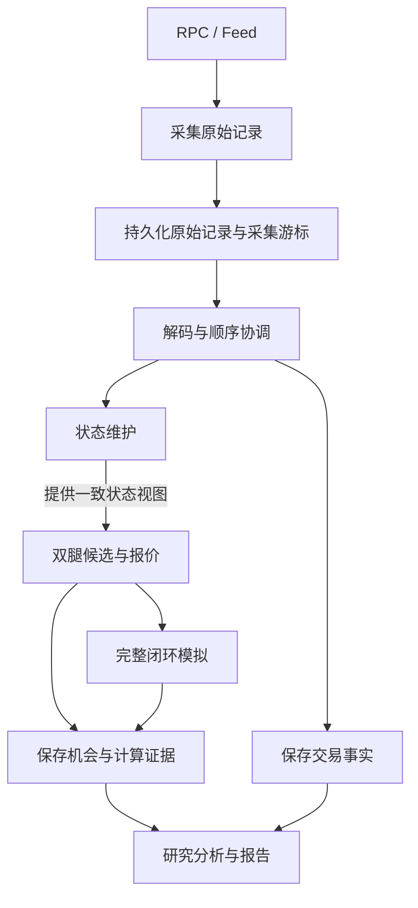

# Robinhood Chain 套利研究架构

状态：架构设计稿；尚未进入程序实现。

更新时间：2026-09-07。

## 1. 目标与范围

使用 Rust 构建一个可持续采集、可重放、可验证结果的 Robinhood Chain 套利研究程序。采用模块化单体，通过明确的数据契约和单向依赖保持模块独立。

第一阶段研究范围已经确认：

- 初始候选为 Pons V2 毕业币及其其他交易池；协议身份、部署和毕业机制在接入前核验。
- 同一代币、两个不同池、同一报价资产的双腿闭环。例如 `ETH → TOKEN → ETH`。
- 分别检查两个交易方向，测试不同输入金额，统计扣除可识别成本后的机会、持续时间和容量。
- 路线结构使用有序交易腿列表，能够表达多腿；候选生成器只生成双腿路线，不实现通用多跳搜索。
- 公开数据只读采集、历史重放、实时计算与完整闭环模拟；不接入私钥、不签名、不广播交易、不建资金池。
- 保存交易事实、归因证据和资产变化，支持钱包研究；不实现自动跟单。
- 优先使用免费 RPC 和公开 Feed，付费服务另行评估预算。

Robinhood Chain 的 EVM 兼容性已有官方文档依据，但实际运行网络、RPC 能力、Feed 协议和目标合约仍必须核验，不能由链架构推断具体接口可用。

## 2. 组织方式与依赖

使用 Cargo workspace，先划分四个 crate。一个进程运行，各 crate 内按功能划分模块。不开微服务，不引入消息中间件和动态插件系统。

| crate | 职责 | 允许依赖的项目 crate |
| --- | --- | --- |
| `arb-core` | 领域类型、协议数学、状态转换、路线和报价计算 | 无 |
| `arb-adapters` | RPC、Feed、协议解码、SQLite、模拟后端 | `arb-core` |
| `arb-research` | 机会统计、容量分析、钱包归因、报告 | `arb-core` |
| `arb-app` | 配置、实时/重放编排、恢复、任务生命周期 | 以上三个 |

`arb-core` 不访问网络、数据库、文件或系统时钟。所需时间、成本参数和状态由调用者传入。`arb-research` 消费类型化记录或迭代输入，不依赖数据库连接；`arb-app` 从存储读取后交给它。

不要求每个模块都有 trait。只在实际需要替换的边界定义小接口，例如实时/重放输入和模拟后端；普通逻辑使用函数与具体类型。具体网络 SDK 类型不进入领域记录，通用地址、哈希和整数原语可以复用成熟库。

## 3. 功能模块

| 模块 | 所属位置 | 输入与输出 | 边界 |
| --- | --- | --- | --- |
| 币池发现 | adapters 解码；core 登记规则；app 驱动扫描 | 工厂/毕业事件、元数据 → 币池登记与核验状态 | 不计算套利收益 |
| 数据采集 | adapters | RPC/Feed → 原始记录 | 不将已排序调用判定为成功成交 |
| 协议适配 | adapters 解码；core 报价数学 | 原始内容 → 领域事件；池状态和金额 → 报价 | 解码和数学分离；报价不访问网络 |
| 状态维护 | core | 起始状态、有序事件 → 一致状态视图 | 不主动补采；缺失通过结果交给 app 处理 |
| 套利计算 | core | 状态视图、币池登记、金额和成本配置 → 候选机会 | 不签名、不执行、不将估计作为事实 |
| 闭环模拟 | adapters | 完整路线、金额、明确状态位置 → 模拟结果 | 不用独立两次报价冒充完整模拟 |
| 数据存储 | adapters | 原始及派生记录 → 持久化记录、游标、检查点 | SQL 不散落到业务模块 |
| 研究分析 | research | 交易事实、机会、模拟结果 → 归因、统计、报告 | 不修改在线池状态 |
| 运行编排 | app | 配置、模块结果 → 调度与恢复操作 | 不承载协议数学和收益公式 |

跨模块调用由 app 组装。协议解码器与报价实现通过同一个协议标识关联，接入一种新协议时不修改双腿路线计算逻辑。

## 4. 核心数据契约

以下是字段语义约束，不是最终 Rust API 或数据库表结构。

| 数据 | 必须表达的信息 |
| --- | --- |
| `RawRecord` | 来源、原始载荷、网络身份、本机接收时间、来源顺序/游标；链上位置在已知时填写 |
| `ChainPosition` | 区块号与哈希、可用时的交易/日志顺序；明确区分区块末与区块内位置 |
| `Observation` | 原始记录引用、解码事件、交易哈希、执行状态；未知字段不填伪造值 |
| `PoolDescriptor` | 网络、池标识（独立合约地址或 PoolManager + PoolId）、协议与版本、代币和报价资产、费用规则、核验和支持状态 |
| `StateView` | 视图标识、状态位置、完整性、确认等级、涉及池的协议状态及参数引用 |
| `Route` | 有序 `Leg` 列表，每腿指定池、协议、输入资产和输出资产 |
| `Opportunity` | 路线、输入金额、报价输出、成本分项、状态视图、配置/算法版本、检测时间 |
| `SimulationResult` | 候选引用、实际模拟状态位置、后端、成功/失败/不可用/未知、资产变化、Gas、错误原因和耗时 |
| `Checkpoint` | 可恢复池状态、币池登记版本、处理位置、原始数据游标和格式版本 |

金额以最小单位整数表示，使用足够宽的整数和显式舍入规则，检查溢出；浮点数仅用于非权威展示。不同报价资产的结果分别统计，未经明确换算不能相加。

确认等级与执行状态是不同字段：交易可能已被排序但执行结果未知，也可能已被区块包含但尚未达到所需确认等级。

未知税费、缺失状态或不支持的 Hook 必须以明确状态传播，不能隐式当作零成本或普通池处理。

## 5. 实时处理流程

先保存原始记录，再应用状态；原始记录及其采集游标在同一存储事务中提交。状态处理进度单独管理，崩溃后从检查点重新应用记录，重复输入不得重复改变状态。

发现新池时先完成元数据和起始状态初始化，再纳入计算。不能只靠启动之后收到的增量事件推断完整池状态。

起始一致性边界使用完整区块处理位置：收齐并应用该区块的相关事件后发布视图。Feed 先记录和用于延迟研究；只有核验其顺序、缺口恢复及状态推导方式后，才增加基于 Feed 的推测视图。推测结果与区块确认结果分开保存和统计。

这一初始选择不声称能够观察或捕获全部区块内机会。后续若需要区块内研究，再增加明确的交易位置状态转换与对应重放支持。

## 6. 状态维护与快照

快照是状态维护模块提供的一致状态视图，不是额外业务模块，也不要求每次复制全部数据或写入数据库。

状态维护负责应用变化；报价计算读取已固定的视图。池 A 和池 B 必须反映截至同一处理位置的全部相关变化。某个池在该区块没有变化，可以沿用旧值，但前提是确认未遗漏事件。

- 每条状态分支由单一任务写入，避免多个任务竞争修改池状态。
- 初版只提取本次计算所需的池状态，形成不可变输入；禁止在同一次报价中读取持续变化的全局池集合。
- 视图携带位置、完整性与确认等级；有缺口的视图不产生有效套利结论。
- 重组时回到共同祖先之前的可用检查点，补采并重放正确分支；找不到可用检查点则重新初始化。
- 原始孤块记录保留，派生结果标记失效；报告排除失效结果，不能静默保留旧收益。
- 从 Feed 推导的状态不能直接冒充回执确认状态，两者需要显式核对。

## 7. 历史重放

重放入口从存储读取记录，复用实时模式的解码、状态转换和套利计算逻辑。用途是复现异常、修改研究参数后重算，以及评估可观测延迟。

重放分清两种语义：

1. **链状态重放**：按规范链顺序还原池状态，验证报价和统计。它回答历史状态中是否存在候选价差。
2. **观察过程重放**：按本机历史接收时间提供信息，复现当时可知道的内容。晚到回执不能提前可见，用于评估发现时间和处理延迟。

链状态更新仍遵循来源顺序与一致性规则；接收时间决定信息何时可用，不代替链上执行顺序。耗时测量使用进程内单调时钟，跨运行保存 UTC 时间和运行标识；跨机器延迟不能未经时钟校准直接相减。

从起始状态或检查点开始重放，使用显式逻辑时间、固定配置和版本。原始记录本身不保证足够重放，必须同时保存所需的初始化状态、元数据及协议参数。

本地报价可确定性复算。历史完整模拟还依赖后端保有对应历史状态；不支持时标记不可用，不能改用最新状态伪装成历史模拟。重放不能证明假设交易真实广播后一定成交。

## 8. 双腿套利与完整模拟

按 `(目标代币, 报价资产)` 分组，仅在同组的两个不同受支持池之间生成路线，检查两个方向。路线必须资产首尾闭合、相邻交易腿资产匹配，第一阶段候选恰好两腿。

对配置的测试金额逐个报价，输出输入、最终输出和成本明细。池手续费与价格影响若已经包含在报价中，不重复扣除；税费和 Gas 必须区分已知值、估计值与未知值。

机会容量初版定义为测试金额集合中符合净收益与支持条件的最大已验证输入额，报告明确这是采样结果，不声称找到全局最优金额或精确容量上界。

机会持续时间按连续有效观察位置计算，并给出采样粒度；断线、缺失和状态失效期间标记未知，不跨缺口拼接持续时间。

模拟必须验证同一执行上下文中的整个闭环，包括前一腿状态变化对后一腿的影响。后端能力探测与协议核验完成后再确定使用节点模拟接口还是本地分叉；必要的调用封装也由这一步确定。暂不承诺任何免费接口支持完整模拟。

模拟状态与报价状态不一致时明确记录差异，不能记作原状态模拟成功。超时和后端不可用与交易执行失败分开；只读阶段仅报告模拟通过率，不报告真实成交成功率。

## 9. 存储、并发与恢复

初版使用 SQLite WAL，单写入任务、小批事务；研究查询使用独立读连接。禁止长时间分析查询无限占用在线资源。

逻辑数据分为原始输入、币池与初始化状态、检查点与游标、交易事实、机会、模拟结果、研究输出。派生记录保留原始引用、状态位置、配置和算法版本，支持追溯与重算。

- 模块间使用有界队列，容量配置化；计算函数直接调用，不为每个模块创建异步任务。
- 队列满时施加背压。来源无法暂停时，记录断开/缺口并补采，暂停受影响状态计算，不静默丢失后继续声称数据完整。
- 原始落盘失败时停止依赖该输入的计算推进，输出可见错误；不能更新持久化游标假装成功。
- RPC 使用并发上限、限流和有上限的退避重试；永久错误和不支持能力不无限重试。
- 退出时停止接收新任务，排空可完成的写入，保存一致游标；未完成工作在重启后幂等恢复。
- 报告记录数据覆盖范围、缺口和不支持池，避免只统计成功样本。

初版保留研究窗口内的原始数据，不自动清理。上线前确定窗口和磁盘预算；容量逼近预算时告警并受控暂停采集，不能未经授权删除研究数据。

## 10. 技术组件

| 用途 | 初选组件 | 使用约束 |
| --- | --- | --- |
| 异步运行 | Tokio | 调度、队列、超时与退出 |
| EVM 交互 | Alloy | 接口兼容性和具体 API 在实现前核验 |
| Feed WebSocket | tokio-tungstenite | 核验协议后使用；SDK 已覆盖时不重复引入 |
| 数据编码 | Serde | 格式带版本；外部输入校验大小与内容 |
| 持久化 | rusqlite / SQLite WAL | 同步数据库工作放专用线程，不阻塞异步执行线程 |
| 日志 | tracing | 带运行、来源、位置和候选标识；避免输出认证信息 |
| 配置 | TOML | 网络端点、限流、测试金额、成本参数、存储与观察窗口 |
| 部署 | Linux + systemd | 单进程托管、自动恢复和日志 |

依赖版本在实现时核验并锁定。配置在启动时校验，错误配置直接拒绝运行；不设计热更新、管理后台或通用插件机制。

## 11. 验证与扩展

验证优先围绕跨模块契约和业务正确性：

- 用已知交易和边界金额核对报价、费用和舍入行为。
- 同一初始状态和输入在实时处理与重放中产生一致核心结果。
- 重复输入不重复改变状态，乱序/缺口不会产生有效视图。
- 重组恢复后的状态与正确分支完整重放一致，旧派生结果失效。
- 双腿路线资产闭合；未知成本不进入确定净收益结论。
- 完整模拟确实承接前一腿的状态变化；超时不会被统计成执行失败。
- 钱包归因区分路由器、打包者、LP、转账、赠币、多腿套利与方向性成交，证据不足保留未知。

| 后续扩展 | 主要修改位置 |
| --- | --- |
| 新 RPC / Feed 来源 | adapters 与 app 配置 |
| 新池协议 | 发现规则、协议解码、core 协议状态与报价实现 |
| 多腿路线搜索 | core 候选生成与相应验证；继续使用路线列表 |
| 新模拟后端 | adapters，保持模拟结果契约 |
| 新数据库 | adapters 存储模块和迁移逻辑 |
| 新统计报告 | research |
| 真实交易执行 | 新增执行与风控边界；另行设计签名、广播和资金安全 |

低耦合不等于任何扩展都零修改。新增协议可能需要新的状态表示；约束是变化集中在协议边界，不把协议特例散落进采集、研究和编排代码。

## 12. 实现前的核验与参数决策

以下不阻止模块边界成立，但在相关功能实现或上线前必须解决，不能静默使用猜测值：

| 项目 | 决策方式与影响 |
| --- | --- |
| 目标运行网络、链 ID、RPC 和 Feed | 查询官方资料并实际探测；记录核验结果，决定采集入口 |
| Pons V2 工厂、池版本、毕业与 Hook 机制 | 核验地址和字节码，确定首个受支持协议 |
| 完整模拟能力 | 实测节点方法、历史状态和闭环调用能力，决定后端 |
| 报价资产与测试金额 | 用户结合研究资金尺度确定；首版仅扫描配置金额 |
| 最低有效深度、收益阈值与确认策略 | 形成显式研究配置，随结果保存 |
| 主机、观察窗口、接口限额与磁盘预算 | 上线前测量数据量与处理耗时，再确定运行配置 |

## 13. 参考与事实边界

- [Robinhood Chain 官方介绍](https://docs.robinhood.com/chain/?lang=en)
- [Robinhood Chain 网络连接文档](https://docs.robinhood.com/chain/connecting/)
- [项目范围与研究目标](../README.md)

本文件规定程序设计，不代表已经验证目标池、公开 Feed、RPC 或完整模拟的可用性。

实施核验补充（T04）：[Pons V2 官方资料](https://docs.ponsfamily.com/v2)说明毕业池使用 Uniswap V4。因此池标识支持 singleton 管理器地址与 PoolId，不仅使用合约地址；具体部署和 Hook 仍由 T09 核验。

### 实现口径补充（T17）

最低有效深度使用当前已证明 tick 区间内、两个方向报价资产容量的较小值，属于保守的局部深度，非池总余额。净收益仅扣除一次已报价后的额外估计成本；Gas 资产不同须提供同一状态位置的换算比例和依据，否则净收益未知。扫描保留深度/利润阈值和排除原因，未知成本不会进入已满足净利润阈值的候选。

### 实现口径补充（T19）

链重放按检查点的区块位置继续，使用原始记录的区块索引分页查询，避免把较早收到的未来区块误认为已处理。处理游标仍保留供审计和观察重放使用。检查点可关联 `research_run_id`；未关联的旧检查点仍可离线读取，但 CLI 不猜测研究参数。实时与重放共享回执/日志完整性校验及状态管线。RPC 附加时间戳不参与日志身份比较，标准字段仍逐项验证。

### 实现口径补充（T20）

原始记录可带成功 RPC 请求的 `request_elapsed_ns`，与原有 `run_id`、UTC 接收时间一起保存；缺失该字段的旧记录仍可加载。处理管线记录解析、状态转换、报价的单调耗时及当前运行标识、UTC 记录时间，重放比较不包含这些非业务字段。尚未执行的模拟不产生模拟耗时。观察重放不做真实 sleep，不把跨运行的墙钟差或时钟倒退转换成精确延迟；相互矛盾的执行结果或分叉要求显式恢复。

### 实现口径补充（T21）

恢复计划通过已保存区块父哈希找共同祖先，并选择该分支上参数匹配的检查点。先完整验证重放序列，再事务保存恢复作业并将孤块派生结果标记失效；原始记录不删除。作业未完成时，新建处理管线也保持暂停，报告层必须排除待恢复运行。恢复重放复用原管线，已写入的新分支块可幂等复用；完成后解除暂停。原分支没有可用检查点时明确要求在已核验位置重新初始化，不拼接未知历史。当前恢复回溯上限为 4096 块；缺块区间保存在计划中，必须补齐后重新生成可执行计划。
